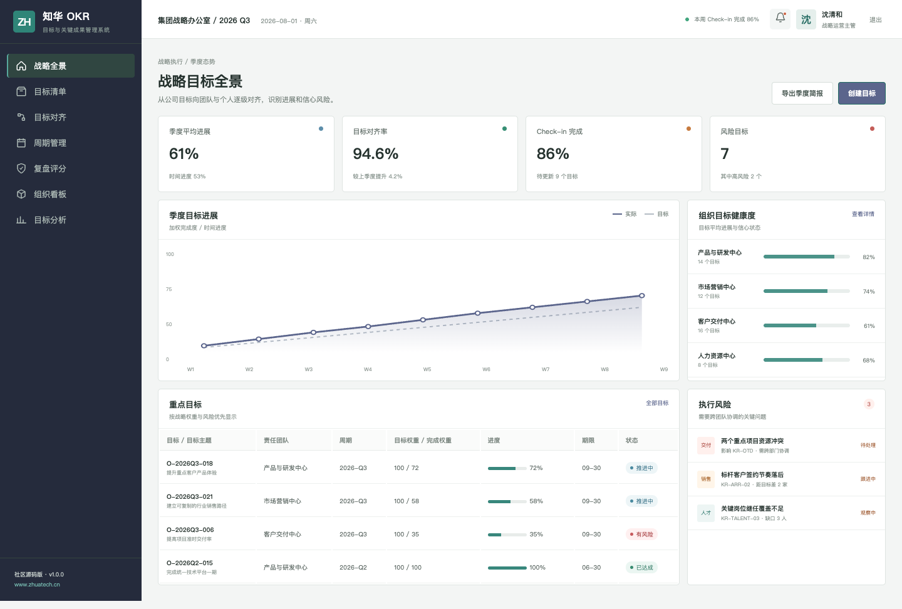
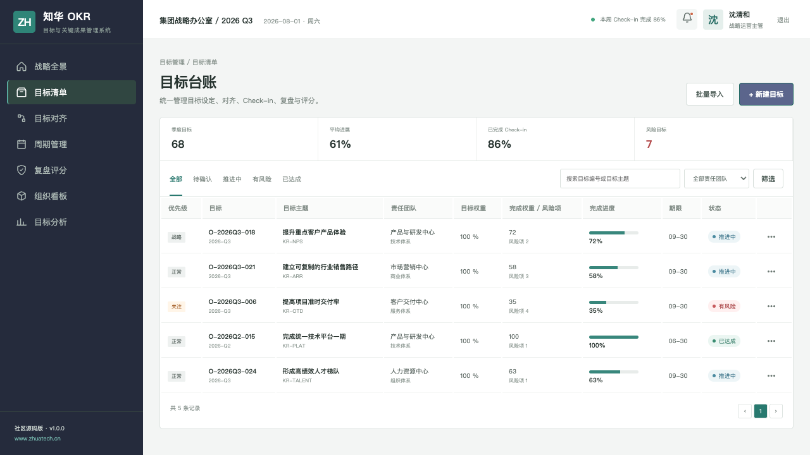
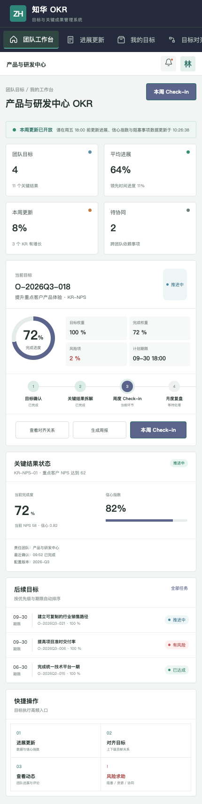

# 知华科技 OKR：把战略变成每周可见的行动

ZhuaTech OKR 是一套前后端分离的目标与关键成果管理系统社区源码版，由**上海如静知华信息科技有限公司**发布。[访问知华科技官网](https://www.zhuatech.cn/)。

> 目标设定只是开始。对齐、Check-in、风险协同和复盘，才构成执行闭环。

## 先看结果



公司和部门管理者从平均进展、时间进度、对齐率、Check-in 完成率与风险目标观察执行质量。



目标清单呈现负责人、团队、周期、权重、进度、信心和风险，支持季度与状态筛选。



个人/团队端把目标更新、上下级对齐、团队动态和风险求助放在一个工作台里，减少“月底补进度”。

## 系统能力地图

| 场景 | 能力 |
| --- | --- |
| 战略拆解 | 公司、部门、团队、个人多级目标 |
| 目标对齐 | 向上贡献、横向依赖、权重关系 |
| 持续跟进 | 周度 Check-in、信心指数、评论动态 |
| 风险协同 | 阻塞事项、资源求助、跨团队协调 |
| 复盘评分 | 自评、主管评议、校准与周期归档 |
| 运营分析 | 进展分布、更新率、对齐质量、风险趋势 |

## 工程基线

- 后端：Java 21、Spring Boot、Security、JPA、Flyway、MySQL
- 前端：Vue 3、Router、Pinia、Axios、Vite
- 包名：`cn.zhuatech.okr`
- 交付：Docker Compose，PC 管理端 + 响应式团队端

## 运行

只看交互界面：

```bash
cd frontend
npm install
npm run dev:demo
```

浏览器进入 `http://localhost:5173`：战略管理端 `planner / Demo@2026`，团队端 `operator / Demo@2026`。

运行完整栈：

```bash
cp .env.example .env
docker compose up --build
```

请先设置独立的 MySQL 密码、Root 密码和足够长度的 `JWT_SECRET`。演示目标、人员和组织均为虚构信息。

## 新增：目标信心预测

新增 `POST /api/admin/objective-confidence`，综合时间消耗、当前进度、风险关键结果、阻塞项、团队信心投票和周度速度，计算进度偏差、交付指数与目标信心，输出 `ON_TRACK`、`AT_RISK` 或 `OFF_TRACK` 预测及纠偏建议。

## 适合继续开发的方向

绩效考核、360 评议、奖金规则、人才盘点、组织架构同步、企业微信/钉钉提醒、AI 目标质量检查、会议复盘、经营指标树和 BI 数据源自动回填。

## 使用和授权

本项目是带有非商业限制的社区源码项目，仅能用于个人学习交流，**不得商用**。企业内部应用、私有化生产部署、SaaS、客户交付、收费培训或咨询均须得到上海如静知华信息科技有限公司书面授权，完整条款见 [LICENSE](LICENSE)。

如需深度开发、绩效模块、组织集成或商业授权，可访问[知华科技官网](https://www.zhuatech.cn/)或扫码添加微信：

| 咨询二维码 1 | 咨询二维码 2 |
| :---: | :---: |
|  |  |

搜索关键词：OKR 管理系统源码、目标管理软件、绩效管理系统、Check-in、战略执行、Java OKR、Vue OKR、知华科技。
